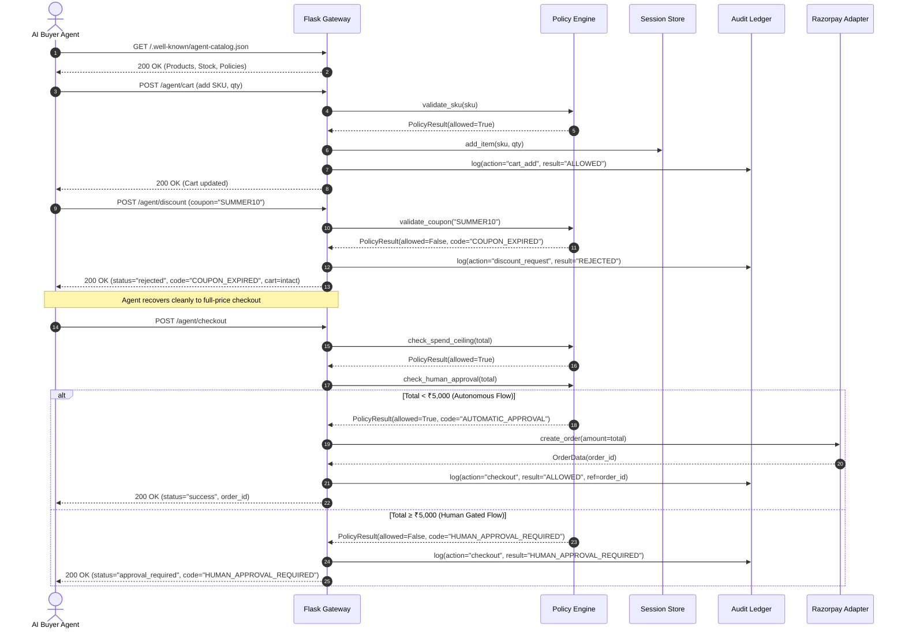
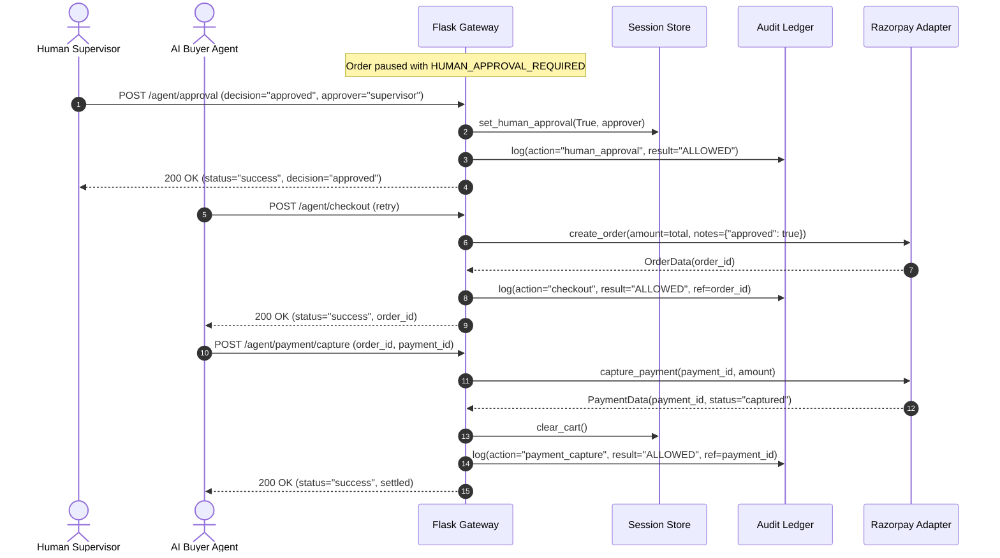

# Agent Storefront — Architecture Specification

> **Razorpay AI Buildathon 2026** — *AI Growth & Agentic Commerce Track*  
> Reference Implementation Specification: Bounded, Policy-Gated & Audited Commerce for Autonomous AI Buyers.

---

## 1. Executive Summary & Philosophy

Agent Storefront establishes a secure protocol boundary between autonomous AI buyer agents and merchant commerce engines. 

In human-centric e-commerce, user interfaces rely on visual deterrence, captchas, and manual form checks. In **agentic commerce**, autonomous software delegates execute programmatic requests. Without strict architectural boundaries, merchants risk algorithmic abuse, infinite discount loops, inventory hoarding, and unconstrained financial liability.

Agent Storefront enforces three foundational invariants:
1. **Bounded Discretion:** Every agent interaction (discovery, carting, discounts, upsells, checkout) is bounded by strict, non-negotiable server-side policies.
2. **Policy-Gated Money Movement:** Orders cannot be placed or settled without passing automated policy checks and, where financial risk exceeds thresholds, explicit human supervisor sign-off.
3. **Immutable Auditability:** Every request, decision, policy evaluation, rejection reason, and payment reference is committed to a persistent, append-only SQLite ledger.

---

## 2. High-Level Architecture Diagram

```text
                           AI BUYER AGENT / SIMULATOR
                                       │
                                       │  JSON over HTTP / REST
                                       ▼
┌─────────────────────────────────────────────────────────────────────────────┐
│                          FLASK COMMERCE GATEWAY                             │
│                                                                             │
│  • /.well-known/agent-catalog.json  --> Catalog discovery standard          │
│  • /agent/cart                      --> Session-scoped cart state           │
│  • /agent/discount                  --> Policy-bounded coupon negotiation   │
│  • /agent/upsell                    --> Constrained companion add-ons       │
│  • /agent/checkout                  --> Policy-gated checkout controller    │
│  • /agent/approval                  --> Human supervisor sign-off gate      │
│  • /agent/payment/capture           --> Razorpay capture & settlement       │
│  • /audit                           --> Real-time ledger queries            │
│  • /dashboard                       --> Merchant operations UI              │
└──────────────┬───────────────────────┬───────────────────────┬──────────────┘
               │                       │                       │
               ▼                       ▼                       ▼
┌─────────────────────────────┐ ┌───────────────┐ ┌───────────────────────────┐
│        POLICY ENGINE        │ │   IN-MEMORY   │ │      RAZORPAY ADAPTER     │
│      (backend/policy.py)    │ │  CART STORE   │ │ (backend/razorpay_client) │
│                             │ │(backend/store)│ │                           │
│ • SKU & Stock Validation    │ │               │ │ • Live Razorpay Test Mode │
│ • Max Discount (≤ 15%)      │ │ • Subtotal    │ │   (with Key ID & Secret)  │
│ • Expiration Check          │ │ • Discounts   │ │ • Zero-Credential Mock    │
│ • Upsell Limit (≤ 1/session)│ │ • Settlement  │ │   Fallback for Testing    │
│ • Spend Ceiling (≤ ₹10,000) │ └───────────────┘ └─────────────┬─────────────┘
│ • Human Approval (≥ ₹5,000) │                                 │
└──────────────┬──────────────┘                                 │
               │                                                │
               ▼                                                ▼
┌─────────────────────────────────────────────────────────────────────────────┐
│                        IMMUTABLE SQLITE AUDIT LEDGER                        │
│                            (backend/audit.py)                               │
│                                                                             │
│   Schema: [id, timestamp, session_id, actor, action, payload, policy_res,   │
│            reason, razorpay_ref]                                            │
└──────────────────────────────────────┬──────────────────────────────────────┘
                                       │
                                       ▼
                       MERCHANT DASHBOARD (frontend/)
                      Real-Time Monitoring & Supervisor Gate
```

---

## 3. End-to-End Request & Data Flows

### 3.1 Autonomous Purchasing Lifecycle



### 3.2 Human Approval Gating Flow



---

## 4. Component Deep Dive

### 4.1 Discovery Protocol (`backend/catalog.py`)
- Standardized machine-readable manifest exposed at `/.well-known/agent-catalog.json`.
- Exposes catalog version, store currency (`INR`), active protocol (`2026-03`), endpoint map, and store policies.
- Only products marked `agent_eligible: true` and `stock > 0` are exposed for autonomous agent purchase.

### 4.2 Policy Engine (`backend/policy.py`)
The policy engine acts as an authoritative, stateless validation barrier:
- **`validate_sku(sku)`**: Ensures SKU exists, is agent-eligible, and maintains active stock.
- **`validate_coupon(code, reference_date)`**: Enforces active status, expiration date verification, and strict discount ceilings (≤ 15%). Expired coupons deterministically return `COUPON_EXPIRED`.
- **`validate_upsell(current_upsells, sku, current_total)`**: Restricts upsell count to maximum 1 per session and ensures combined price remains within the spend ceiling.
- **`check_spend_ceiling(amount)`**: Rejects any transaction exceeding ₹10,000 with `SPEND_CEILING_EXCEEDED`.
- **`check_human_approval(amount, human_approved)`**: Evaluates whether transaction total ≥ ₹5,000. If `human_approved=False`, halts execution with `HUMAN_APPROVAL_REQUIRED`.

### 4.3 In-Memory Session Store (`backend/store.py`)
- Manages session-scoped carts (`Cart` and `CartItem` domain models).
- Calculates subtotals, item totals, and applied discounts strictly server-side.
- Retains cart integrity during coupon rejections, ensuring zero state corruption during recovery.

### 4.4 Immutable Audit Trail (`backend/audit.py`)
- Backed by an ACID-compliant SQLite ledger (`audit.db`).
- Captures:
  - `timestamp`: ISO-8601 UTC timestamp.
  - `session_id`: Unique buyer session identifier.
  - `actor`: `buyer_agent` or `merchant`.
  - `action`: State-changing operation (e.g. `cart_add`, `discount_request`, `checkout`, `human_approval`, `payment_capture`).
  - `payload_summary`: JSON-serialized summary of input parameters.
  - `policy_result`: Canonical verdict (`ALLOWED`, `REJECTED`, `HUMAN_APPROVAL_REQUIRED`).
  - `reason`: Explanation or rejection cause.
  - `razorpay_ref`: Razorpay Order ID or Payment ID reference.
- Exposes indexed queries ordered by newest first via `GET /audit`.

### 4.5 Razorpay Payment Adapter (`backend/razorpay_client.py`)
- Provides unified `BaseRazorpayClient` interface:
  - `create_order(...)`
  - `capture_payment(...)`
  - `verify_payment_signature(...)`
- **Test Mode (`RazorpayClientWrapper`):** Utilizes the official Razorpay Python SDK when valid credentials (`RAZORPAY_KEY_ID`, `RAZORPAY_KEY_SECRET`) are present.
- **Deterministic Mock (`MockRazorpayClient`):** Utilized when credentials are not configured or when `FORCE_MOCK_RAZORPAY=true`. Generates deterministic identifiers (`order_mock_...`, `pay_mock_...`) and computes paise conversions accurately for zero-credential offline evaluation.

---

## 5. Security & Boundary Guardrails

| Boundary | Enforcement Point | Failure Behavior |
|---|---|---|
| **Price Tampering** | Server-side `store.py` calculation | Client prices ignored; canonical catalog price used |
| **Excessive Discounts** | `policy.py` (`validate_coupon`) | Rejection with `DISCOUNT_EXCEEDS_POLICY_MAX` |
| **Expired Coupon Exploit** | `policy.py` (`validate_coupon`) | Rejection with `COUPON_EXPIRED` (HTTP 200, clean recovery) |
| **Runaway Agent Spending** | `policy.py` (`check_spend_ceiling`) | Rejection with `SPEND_CEILING_EXCEEDED` (> ₹10,000) |
| **High-Value Exposure** | `policy.py` (`check_human_approval`) | Halted with `HUMAN_APPROVAL_REQUIRED` (≥ ₹5,000) |
| **Upsell Spam** | `policy.py` (`validate_upsell`) | Rejection with `UPSELL_LIMIT_EXCEEDED` (> 1 upsell) |
| **Unauthorized Capture** | `app.py` (`agent_payment_capture`) | Blocked if supervisor rejected or order unapproved |
| **Audit Ledger Tampering** | `audit.py` (Append-Only SQL) | Immutable `INSERT`-only operations during runtime |

---

## 6. Reference Implementation Disclaimer

> **ARCHITECTURAL SCOPE & PRODUCTION NOTICE:**  
> This system is a reference implementation engineered specifically for the **Razorpay AI Buildathon 2026**. Its purpose is to model and validate the emerging interface between autonomous AI buyers and merchant commerce infrastructure.
>
> While it implements rigorous server-side guardrails, it is **not** claimed to be an enterprise production system. In a production deployment, in-memory cart stores would be replaced with distributed Redis/PostgreSQL clusters, authentication tokens (OAuth2/JWT) would bind agent identities, and Razorpay Webhook signature verification would handle asynchronous settlement callbacks.
